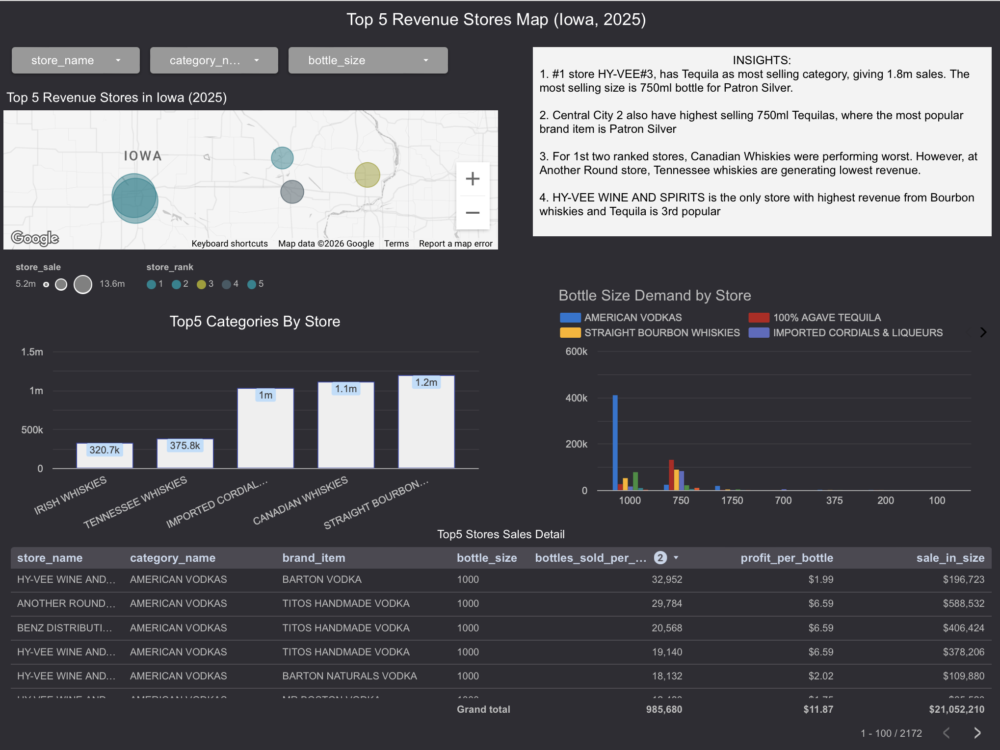

## Q1. Top 5 Category Revenue Trend (2021–2025)

Understanding category trends is essential for inventory planning, shelf allocation, and supplier negotiation. If a dominant category is declining, the business must act before revenue erodes. If a smaller category is accelerating, early shelf investment pays off.

.png)

### Key Finding:
- American Vodkas is Iowa's highest revenue category at $64.9M in 2025 with 31.8M bottles sold from 2021 - 2025, but is showing a concerning decline trend: 0.4% down in 2024 and 3.2% in 2025. This signals market saturation or shifting consumer preference away from standard vodka SKUs.
- Canadian Whiskies peaked in 2023 at $50.4M with strong 10% growth, but reversed sharply, declining 8.1% in 2025 to $45.8M. 
- Straight Bourbon Whiskies and 100% Agave Tequila are the growth stories. Bourbon grew consistently from $34.5M to $40M with positive YoY across all years. Tequila is the fastest-growing category with 9.01% average YoY growth and the highest profit per bottle at $9.69, nearly 3x Vodka's $3.39.
- Whiskey Liqueur is the smallest category at $27M but maintained positive YoY in 2025 at 1.9%, steady and profitable at $1.99/bottle.

### Recommendation:
  - Reduce shelf allocation for American Vodkas and Canadian Whiskies, both declining, low margin ($3.39 and $5.38)
  - Increase ordering for 100% Agave Tequila - highest growth AND highest profit per bottle ($9.69)
  - Straight Bourbon has stable growth, maintain current allocation

## Remove Items in 2026

### Key Finding: Three items identified for discontinuation based on near-total YoY revenue collapse (approx. -99%) with minimal 2025 revenue despite presence in 5–7 stores:

## Q2. Which stores generated the most revenue in 2025, and do their top orders match overall top 5 categories?
This question drives a real business decision: standardize shelves vs localize shelves.
If top stores earn from the same statewide top 5 categories:
  - Demand is broad and repeatable.
  - One core assortment strategy can scale across stores.
  - Easier procurement, pricing, and inventory planning.
If top stores earn from non-top5 categories (outliers):
  - Local/niche demand is strong.
  - Store-level customization creates more value than uniform shelves.

Every single store has at least one "Other" category in their top 5. This means the answer is neither pure standardization nor pure localization; it's a hybrid strategy.

### Key Finding:

  - HY-VEE #3 / BDI / Des Moines - $13.7M (Rank 1) Top category is 100% Agave Tequila at $1.8M, neck-and-neck with American Vodkas at $1.8M. Tequila generates same revenue with only 50.4k bottles vs Vodkas needing 129.4k bottles meaning Tequila is nearly 3x more efficient per bottle. Top 5th category is Imported Cordials & Liqueurs (NON TOP-5).
  - Central City 2 - (Rank 2) Mirrors HY-VEE #3 pattern almost identically. Tequila + Vodkas dominate, Imported Cordials as 5th popular category (NON TOP-5).
  - Another Round / DeWitt - (Rank 3) Smaller revenue bars overall, but Tennessee Whiskies appears as a top-5 category- a statewide non-top-5. Local demand outlier.
  - HY-VEE Wine and Spirits #1 / Iowa City - (Rank 4) American Vodkas is the dominant driver. Irish Whiskies appears as 5th category (Other) - another local outlier.
  - BENZ Distributing - (Rank 5) Agave Tequila and American Vodkas nearly equal revenue. Unique split suggesting this store's customer base is evenly split between the two.
  
### Recommendation

For high-volume urban stores (like HY-VEE #3 profile): Shift shelf space from Vodka to Tequila --> Same revenue, fewer SKUs, better margin efficiency

## Q3. Where are Iowa's top 5 revenue stores geographically, what do they sell most, and how profitable is it per bottle?

Geographic concentration reveals market saturation and white-space opportunity. If all top stores cluster in one metro, rural regions may be underserved - or demand simply does not exist there. Per-bottle profit alongside category shows which product mix is most efficient, not just which is highest volume.

Iowa's top 5 revenue stores are not evenly distributed. The map shows clear concentration: the two largest stores (HY-VEE #3 and Central City 2, visible as the largest bubbles) are in the Des Moines metro area in central-western Iowa. Two stores cluster in eastern Iowa, and one sits in a mid-state position.
### Key Findings:
  - #1 store HY-VEE#3, has Tequila as most selling category, giving 1.8m sales. The most selling size is 750ml bottle for Patron Silver.
  - Central City 2 also have highest selling 750ml Tequilas, where the most popular brand item is Patron Silver
  - For 1st two ranked stores, Canadian Whiskies were performing worst. However, at Another Round store, Tennessee whiskies are generating lowest revenue.
  - HY-VEE WINE AND SPIRITS is the only store with highest revenue from Bourbon whiskies and Tequila is 3rd popular
